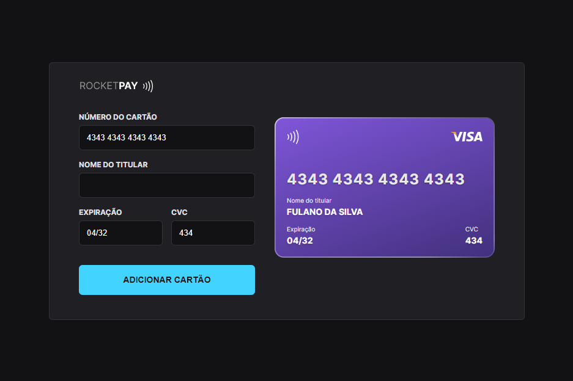

<h1 align="center">Rocketpay 💳</h1>

  Projeto desenvolvido durante o evento exclusivo e gratuito, promovido pela Rocketseat para ensinar sobre tecnologias Web.

  <a href="#-objetivo">Objetivo</a>&nbsp;&nbsp;&nbsp;|&nbsp;&nbsp;&nbsp;
  <a href="#-tecnologias">Tecnologias</a>&nbsp;&nbsp;&nbsp;|&nbsp;&nbsp;&nbsp;
  <a href="#-projeto">Projeto</a>&nbsp;&nbsp;&nbsp;|&nbsp;&nbsp;&nbsp;
  <a href="#-layout">Layout</a>&nbsp;&nbsp;&nbsp;|&nbsp;&nbsp;&nbsp;
  <a href="#-licença">Licença</a>

  

  

## 📌 Objetivo

Esse projeto propôs ensinar algumas funcionalidades da linguagem JavaScript, como:

- Manipulação da DOM com JS.
- Adicionar e capturar eventos.
- Remover ação padrão de recarregar a página ao clicar no botão do formulário.
- Utilizar códigos de terceiros, como o IMask.js que permite criar máscaras para os inputs.
- Acessar uma função através do globalThis pelo DevTools.

## 🚀 Tecnologias

Projeto desenvolvido com as seguintes tecnologias:

- HTML5 e CSS3
- JavaScript e JSON
- [Node e NPM](https://nodejs.org/)
- [Vite](https://vitejs.dev/)
- [iMask](https://imask.js.org)

## 💻 Projeto

O Rocketpay é um componente que simula o formulário de preenchimento de cartão de crédito, onde é possível adicionar máscara aos inputs e atualizar elementos (HTML) via DOM.

No projeto foi implementado máscaras dinâmicas para reconhecer qual a bandeira do cartão apenas digitando os primeiros números do cartão.

As máscaras implementadas foram visa e mastercard, deixando como desafio implementar as outras mais conhecidas.

Então foram implementados as bandeiras, elo e american express, além da mudança do layout feita nos cartões.

## 🎨 Layout

Você pode visualizar o layout dos cartões e do formulário através [desse link](https://www.figma.com/file/gpqavL469k0pPUGOmAQEM9/Explorer-Lab-%2301/duplicate). É necessário ter conta no [Figma](https://figma.com) para acessá-lo.

---

## 📝 Licença

Esse projeto está sob a licença MIT.

---
